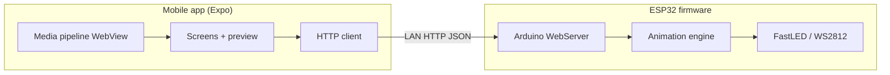

# LED Poster

A cross-platform **mobile app** plus **ESP32 firmware** stack for designing, previewing, and streaming **animations to a physical addressable LED matrix** over a **local Wi‑Fi** network—without USB for day‑to‑day control once the microcontroller is programmed.

---

## Highlights

| Area | Summary |
|------|---------|
| **Phone app** | [Expo](https://expo.dev/) / React Native: control playback, preview on a logical grid, gallery, **image & GIF → LED‑grid pipeline** (WebView + canvas processing). |
| **Firmware** | [PlatformIO](https://platformio.org/) / Arduino framework: REST API over HTTP, chunked animation uploads, WS2812‑class output with **dual‑strip mapping** calibrated for this hardware. |
| **Contract** | Versioned **`AnimationData`** JSON (row‑major RGB frames); details in **`app/lib/types.ts`** and **`docs/LED_POSTER_APP_GUIDE.md`**. |

---

## How it works

1. **MCU** joins your LAN as Wi‑Fi **station**; credentials live in **a header file not committed** to this repo (see **`firmware/README.md`** for a template).  
2. After booting, firmware prints a **LAN base URL** over serial logs; you save that **`http://<device-ip>`** as the ESP base URL in the app (**Settings**).  
3. The app loads its UI from **Metro** during **Expo Go** development (`cd app && npx expo start`). **Poster control** uses **`fetch`** to the ESP **on the same network** as the phone—no reliance on laptop USB for HTTP during normal runs.  
4. **Imports** optionally query **`GET /caps`** so GIF frame budgets match **approximate MCU memory**. Uploads use **chunked POSTs** (**`/animation/begin`**, **`/frame`**, **`/commit`**) so the embedded web server avoids buffering oversized JSON blobs.  

For protocol tables, previews, GIF handling, FPS behavior, and EAS‑style builds, see **[`docs/LED_POSTER_APP_GUIDE.md`](docs/LED_POSTER_APP_GUIDE.md)**.



---

## Repository layout

| Path | Role |
|------|------|
| **`app/`** | Expo/React Native UI, HTTP client (`lib/api.ts`), import pipeline (`lib/processorHtml.ts`), gallery. **`app/README.md`** — running Metro / Expo Go, cleartext LAN permissions. |
| **`firmware/`** | PlatformIO project, FastLED routing, chunked upload handlers. **`firmware/README.md`** — **`wifi_config.h` setup**, flashing, pins (default targets **Seeed XIAO ESP32‑S3** + **32×48** logical grid in firmware defaults). |
| **`docs/`** | Long‑form architecture and reproduction guide (**`LED_POSTER_APP_GUIDE.md`**). |

Root **`.gitignore`** excludes local Wi‑Fi header (`firmware/include/wifi_config.h`), build artifacts (`firmware/.pio/`), **`node_modules`**, and optional local/agent folders—not published as part of a normal clone.

---

## Prerequisites

| Component | Typical setup |
|-----------|----------------|
| Firmware | PlatformIO CLI, USB cable for flash and serial logs. Target board and toolchain per **`firmware/platformio.ini`**. |
| App | Node.js **LTS**, `npm install` inside **`app/`**, **Expo Go** on phone (dev workflow). |

---

## Quick start (summary)

Full commands and troubleshooting live in nested README files.

```bash
# Firmware (from repo root → firmware/)
cd firmware
pio run -t upload          # requires local wifi_config.h — see firmware/README.md
pio device monitor -b 115200

# Expo app (separate terminal, from repo root → app/)
cd app
npm install
npx expo start
```

Configure the MCU’s Wi‑Fi **once per network change** via the **local** **`wifi_config.h`** template (**never commit** secrets). Paste the **`http://`** base URL printed at boot into the app.

---

## Security & privacy posture

Publishable clones should ship **without** SSIDs, passwords, API keys, or device‑specific IPs. This repository is structured so **`wifi_config.h`** stays ignored; **HTTP to the MCU is LAN‑scoped and unsigned in stock firmware**, so treat deployments like other **trusted‑LAN IoT**: segment guests, WPA2/WPA3, optional VLAN isolation. See **`app/README.md`** for cleartext HTTP flags on Android/iOS (required for **`http://…`** LAN access during development).

---

## Documentation

| Document | Purpose |
|----------|---------|
| **[`docs/LED_POSTER_APP_GUIDE.md`](docs/LED_POSTER_APP_GUIDE.md)** | App design rationale, FPS/timing notes, REST surface (`/caps`, chunked animation), provisioning model, tooling. |
| **[`app/README.md`](app/README.md)** | Running the Expo client, tunnels, configuring ESP URL. |
| **[`firmware/README.md`](firmware/README.md)** | Board target, **`wifi_config.h`** template (create locally only), flashing. |

---

## Roadmap (non‑blocking)

Optional directions mentioned in docs and product notes include **standalone app builds**, **remote LLM‑assisted** animation authoring (would require hosted API keys & guardrails), and **alternate transports** beyond HTTP—none required for core LED poster workflows.

---

## Author

**DVThomas01** ([@DVThomas01](https://github.com/dvthomas01)) — project author and maintainer.

GitHub URLs are case-insensitive; **`dvthomas01`** is the account handle.

---

## Commit attribution (project policy)

Commits on this repository are attributed **only** to the human maintainer (**DVThomas01**). Do **not** add **`Co-authored-by:`** lines for AI coding assistants, bots, or automation to keep the **Contributors** graph accurate. (Use your editor’s setting to disable automatic co-author trailers.)

---

## License

No **`LICENSE`** file is included yet. Choose and add one (for example MIT, Apache‑2.0, or AGPL) before redistributing or packaging store builds if licensing matters for your audience.
